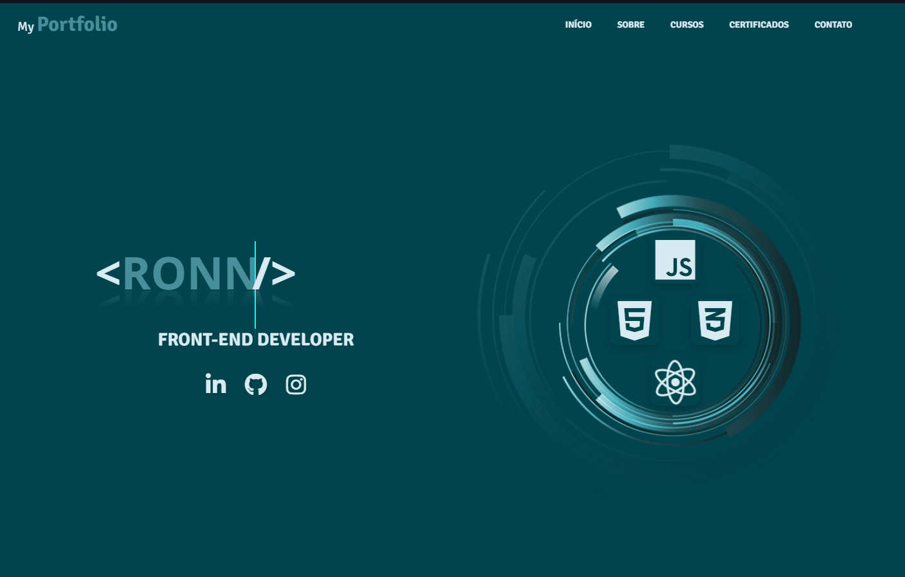
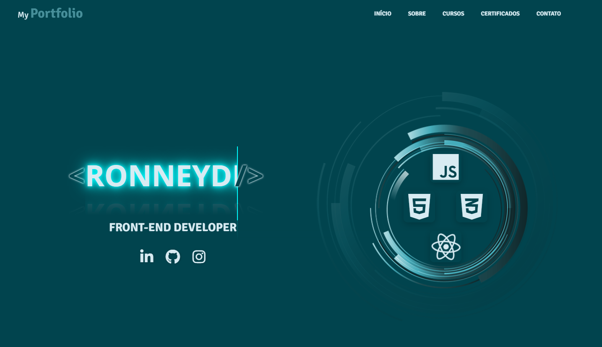
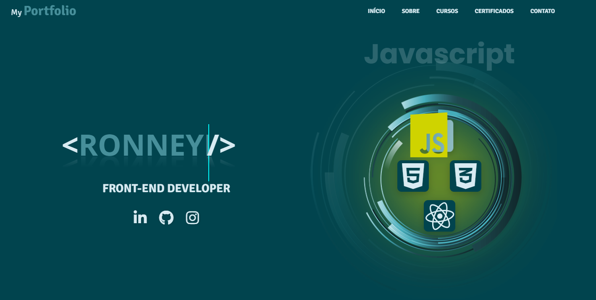
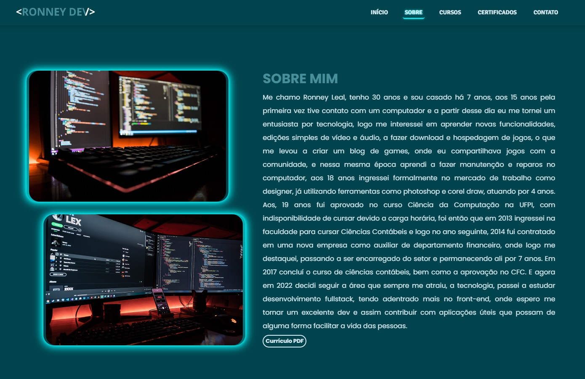
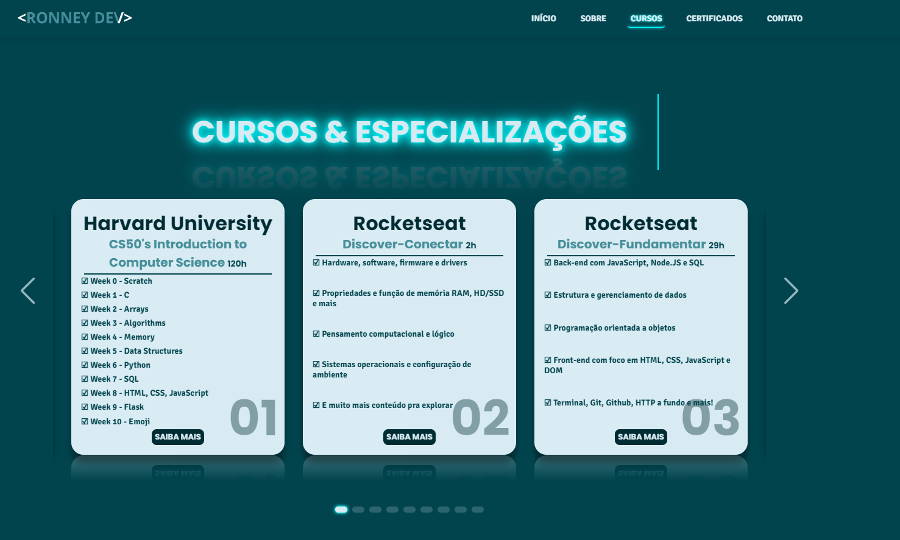
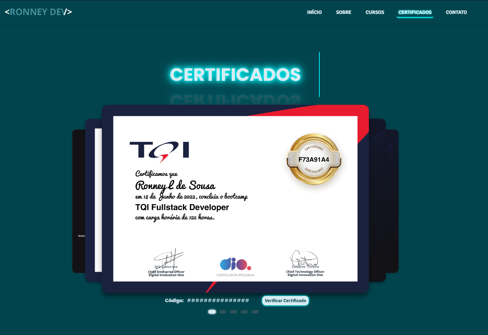
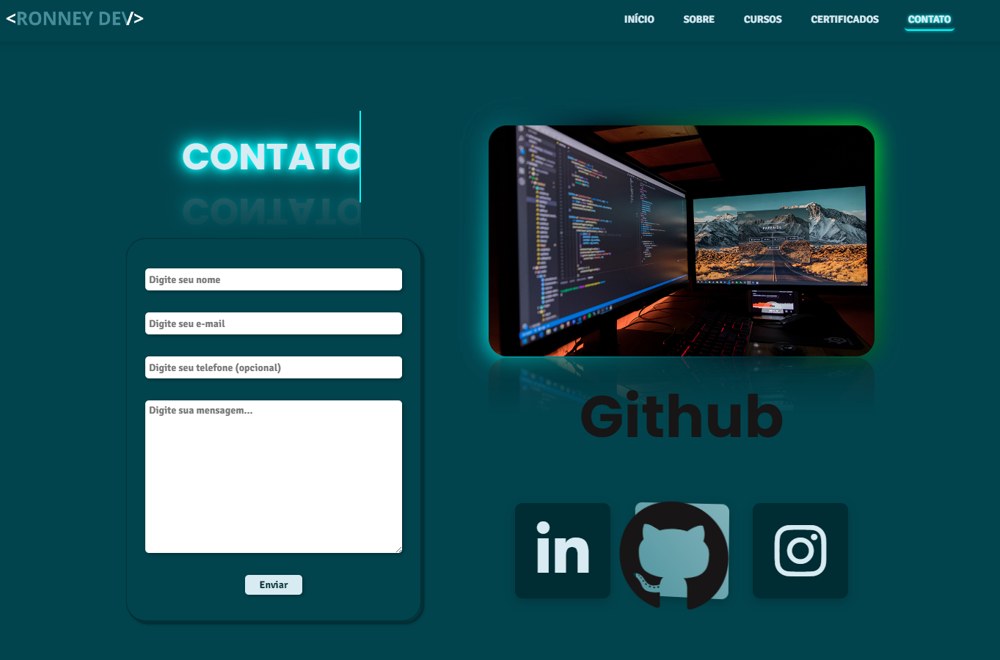

## MyPortfolio

### Ronney Leal

#### Picos - PI - Brasil

#### Video Demo: <https://youtu.be/fEo4I0nGODo>

<!-- /////////////////LINGUAGENS////////////////////// -->

### Na construção do projeto foi utilizado:

- Html
- Css
- Javascript

### No projeto foi utilizado vários efeitos e animações em CSS apenas para demonstração de algumas coisas que podemos fazer utilizando CSS, também foi utilizado recursos do Vanilla e Swiper.

<!-- /////////////////SCREENSHOTS////////////////////// -->

##### Logo na página principal temos algumas animações, como na logo principal no centro da tela com um efeito simulando uma digitação, e ao posicionar o mouse em cima ou um toque simples no touchscreen do dispositivo móvel ativará um efeito de iluminação.

##### Ao lado também temos as logos das linguagens que tenho estudado mais ultimamente, e ao posicionar novamente o mouse ou o touch ativará o efeito vanilla.

##### Na página sobre, temos um resumo sobre mim e 2 imagens com um efeito de loop fazendo uma borda contornando as imagens.

##### Na página cursos, temos o título da página com efeito de acender e apagar com neon, juntamente com a animação de digitação, abaixo temos alguns cards que listam alguns cursos que tenho feito e uma breve descrição do que foi visto no curso, esses cards estão utilizando o swiper, que faz o efeito slider nos cards.

##### Na página certificados, temos novamente a repetição do efeito no título e abaixo os certificados referentes aos cursos, porém o slide dos certificados é feito apenas clicando na parte visível do certificado que está abaixo do ativo na tela, abaixo dos certificados tem o código e o botão para direcionar ao site dos cursos para validar o certificado.

##### Na última página temos novamente o título com efeito se repetindo, temos abaixo do título um formulário para enviar um e-mail que será encaminhado diretamente para minha caixa de entrada, ao lado uma imagem com um neon em gradiente abaixo, e logo abaixo da imagem temos os ícones para as redes sociais, o qual também estão utilizando o efeito vanilla ao posicionar o mouse acima ou um toque no touchscreen.

